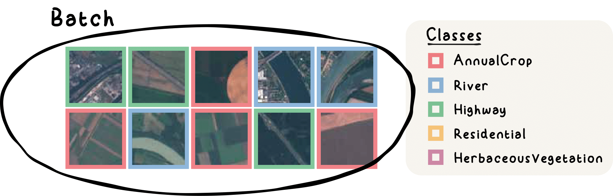
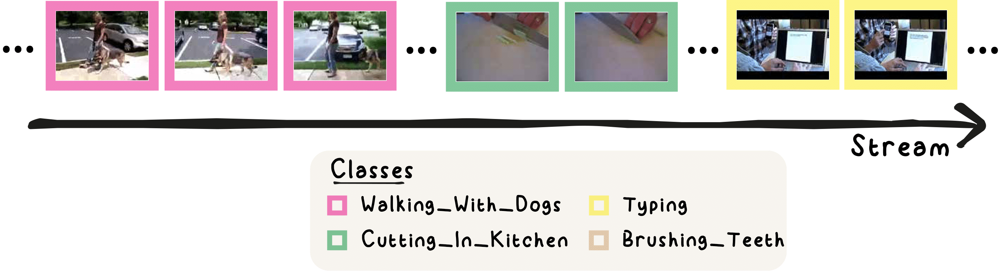

# Realistic Test-Time Adaptation of Vision-Language Models (StatA)
The official implementation of [*Realistic Test-Time Adaptation of Vision-Language Models*]().

Authors:
[Maxime Zanella*](https://scholar.google.com/citations?user=FIoE9YIAAAAJ&hl=fr&oi=ao),
[Clément Fuchs*](https://scholar.google.com/citations?user=ZXWUJ4QAAAAJ&hl=fr&oi=ao),
[Christophe De Vleeschouwer](https://scholar.google.ca/citations?user=xb3Zc3cAAAAJ&hl=en),
[Ismail Ben Ayed](https://scholar.google.com/citations?user=29vyUccAAAAJ&hl=fr&oi=ao).

*Denotes equal contribution

## Quick Overview

We introduce **StatA**, a robust and versatile unsupervised transductive method designed to handle diverse deployment scenarios, including those involving a variable number of effective classes during testing. Our approach features a novel anchor-based regularization term specifically crafted for Vision-Language Models (VLMs). This term serves as a statistical anchor, preserving the initial knowledge of the text encoder, especially in low-data settings.

The experiments presented in this paper are organized into two main categories:  
1. **Batch Adaptation: Test-time adaptation methods are applied independently to each batch with a varying number of effective classes.**

   <div align="center" style="margin-top:20px; margin-bottom:20px;">
      
      <p style="font-size:75%;"><em>Realistic batches may not contain all the classes of interest.</em></p>
   </div>

   <div align="center" style="margin-top:20px; margin-bottom:20px;">
      
      <p style="font-size:75%;"><em>StatA brings consistent improvement when facing Low (between 2 and 10), Medium (between 5 and 25) number of effective classes (Keff) in each batch, or All classes. In comparison, other transductive methods engender significant performance drops in at least one scenario.</em></p>
   </div>


2. **Online Adaptation: Test-time adaptation methods are applied to a continuous stream of batches with varying correlation in the appearance of each class.**  

   <div align="center" style="margin-top:20px; margin-bottom:20px;">
      
      <p style="font-size:75%;"><em>Realistic data streams contain correlated frames.</em></p>
   </div>

   <div align="center" style="margin-top:20px; margin-bottom:20px;">
      
      <p style="font-size:75%;"><em>StatA shows strong performance when applied on streams of data, with Low or High correlation between batches, and when all the classes are appearing sequentially (Separate).</em></p>
   </div>


## Table of Contents

1. [Installation](#installation) 
2. [Usage](#usage)
3. [Batch adaptation](#batch-adaptation)
4. [Online adaptation](#online-adaptation)
5. [Citation](#citation)
6. [Contact](#contact) 


---

## Installation
This repository requires to install an environment and datasets:
### Environment
Create a Python environment with your favorite environment manager. For example, with `conda`: 
```bash
conda create -y --name my_env python=3.10.0
conda activate my_env
pip3 install -r requirements.txt
```
And install Pytorch according to your configuration:
```bash
pip3 install torch==2.0.1 torchaudio==2.0.2 torchvision==0.15.2
```
### Datasets
Please follow [DATASETS.md](DATASETS.md) to install the datasets.
You will get a structure with the following dataset names:
```
$DATA/
|–– imagenet/
|–– caltech-101/
|–– oxford_pets/
|–– stanford_cars/
|–– oxford_flowers/
|–– food-101/
|–– fgvc_aircraft/
|–– sun397/
|–– dtd/
|–– eurosat/
|–– ucf101/
```

## Batch Adaptation
We present the basic usage to get started with our method. Each batch is generated using a data sampler (see `sampler.py`) called **BatchSampler**. The **BatchSampler** dynamically samples a specified number of effective classes (i.e., the number of classes effecitvely present in each batch) and corresponding indices from the dataset.


Here is an example for the imagenet dataset, with the CLIP-ViT-B/16 architecture, a batch size of 64, a variable number of effective classes between 1 and 4. This experiment is run 1000 times.
```bash
python3 main.py --root_path /path/to/datasets/folder --dataset imagenet --method StatA --backbone vit_b16 --batch_size 64 --num_class_eff_min 1 --num_class_eff_max 4 --n_tasks 1000
```

To run the whole experiment of Table 1 in the paper, use the following command:
```bash
bash ./scripts/StatA_batch.sh /path/to/datasets/folder vit_b16
```

The table below summarizes the **average performance** (averaged over 11 datasets) you should obtain by running the above script.

For a small batch size of **64**, we focus on three realistic configurations:
- **Very Low**: 1–4 effective classes
- **Low**: 2–10 effective classes
- **Medium**: 5–25 effective classes

For a larger batch size of **1000**, we examine:
- **Medium**: 5–25 effective classes
- **High**: 25–50 effective classes
- **Very High**: 50–100 effective classes

Additionally, we provide the results on the full dataset, containing **All Classes**.


|     | Very Low | Low  | Medium  | Medium | High | Very High | All Classes    |
|----------------|----------------|-------------|---------------------|-----------------------|--------------|---------------------|----------------|
| **Batch Size** | **64**         | **64**      | **64**             | **1000**              | **1000**     | **1000**           | **All Dataset** |
| **CLIP**       | 65.2           | 65.2        | 65.2               | 65.2                  | 65.2         | 65.2               | 65.2           |
| **MTA**        | 66.6 `↑1.4`    | 66.6 `↑1.4` | 66.6 `↑1.4`        | 66.6 `↑1.4`           | 66.6 `↑1.4`  | 66.6 `↑1.4`        | 66.6 `↑1.4`    |
| **Dirichlet**  | <ins>68.5</ins> `↑3.3`    | **70.3** `↑5.1` | **67.5** `↑2.2`    | <ins>64.4</ins> `↓0.8`           | 45.3 `↓20.0` | 33.6 `↓31.6`       | 29.5 `↓35.7`   |
| **ZLaP**       | 27.5 `↓37.7`   | 35.2 `↓30.0`| 44.7 `↓20.6`       | 41.5 `↓23.7`          | 52.2 `↓13.0` | 58.4 `↓6.8`        | 66.4 `↑1.1`    |
| **TransCLIP**  | 38.9 `↓26.3`   | 40.4 `↓24.8`| 42.7 `↓22.5`       | 56.5 `↓8.7`           | <ins>62.0</ins> `↓3.3`  | <ins>64.4</ins> `↓0.8`        | **70.3** `↑5.1`|
| **StatA** | **70.4** `↑5.1`| <ins>69.3</ins> `↑4.1` | <ins>67.4</ins> `↑2.2`        | **69.7** `↑4.4`       | **69.8** `↑4.5` | **69.0** `↑3.7`    | <ins>69.9</ins> `↑4.7`    |


StatA demonstrates robustness across all scenarios, whereas other transductive methods exhibit strong performance only within specific, narrow application ranges.
For more detailed results, please refer to **Table 1** in the paper.


## Online Adaptation
We present the basic usage to get started with our method. Each batch is generated using a data sampler (see `sampler.py`) called **OnlineSampler**. The **OnlineSampler** dynamically samples indices from the dataset according to a Dirichlet law parametrized by gamma (see Appendix of the paper for more details).

Here is an example for the imagenet dataset, with the CLIP-ViT-B/16 architecture, a batch size of 128, a stream correlation factor gamma of 0.1. This experiment is run 100 times.
```bash
python3 main.py --root_path /path/to/datasets/folder --dataset imagenet --method StatA --backbone vit_b16 --batch_size 64 --online --gamma 0.1 --n_tasks 100
```

To run the whole experiment of Table 2 in the paper, use the following command:
```bash
bash ./scripts/StatA_online.sh /path/to/datasets/folder vit_b16
```

The table below presents the **average performance** (averaged over 11 datasets) you should obtain by running the above script.

We focus on four realistic configurations:
1. **Low correlation in the stream** ($\gamma = 0.1$).
2. **Medium correlation in the stream** ($\gamma = 0.01$).
3. **High correlation in the stream** ($\gamma = 0.001$).
4. **Classes appearing sequentially** (Separate).


|           | Low | Medium  | High | Separate  |
|------------------|----------------------|--------------------------|-------------------------|--------------------------|
| CLIP            | 65.2                | 65.2                    | 65.2                   | 65.2                    |
| MTA             | 66.6 `↑1.4`         | 66.6 `↑1.4`             | 66.6 `↑1.4`            | **66.6** `↑1.4`         |
| TENT             | 65.8 `↑0.6`     | 65.5 `↑0.2`           | 65.3 `↑0.1`          | 64.5 `↓0.7`           |
| TDA             | **67.7** `↑2.5`     | <ins>67.1</ins> `↑1.9`           | <ins>66.8</ins> `↑1.6`          | <ins>66.6</ins> `↑1.4`           |
| DMN             | <ins>67.2</ins> `↑2.0`         | 66.5 `↑1.2`             | 66.3 `↑1.0`            | 65.8 `↑0.6`             |
| Stat${\cal A}$  | 67.0 `↑1.7`       | **68.9** `↑3.7`         | **69.5** `↑4.2`        | **69.1** `↑3.8`         |


StatA demonstrates robustness across all scenarios, providing a strong baseline for future reasearch in the field.
For more detailed results, please refer to **Table 2** in the paper.


## Citation

If you find this repository useful, please consider citing our paper:
```
@article{
}
```

You can also cite the TransCLIP paper on which this work is based on:
```
@article{zanella2024boosting,
  title={Boosting Vision-Language Models with Transduction},
  author={Zanella, Maxime and G{\'e}rin, Beno{\^\i}t and Ayed, Ismail Ben},
  journal={arXiv preprint arXiv:2406.01837},
  year={2024}
}
```

## Contact

For any inquiries, please contact us at [maxime.zanella@uclouvain.be](mailto:maxime.zanella@uclouvain.be) and [clement.fuchs@uclouvain.be](mailto:clement.fuchs@uclouvain.be) or feel free to [create an issue](https://github.com/MaxZanella/StatA/issues).


## License
[AGPL-3.0](https://github.com/MaxZanella/StatA/blob/main/LICENSE)
